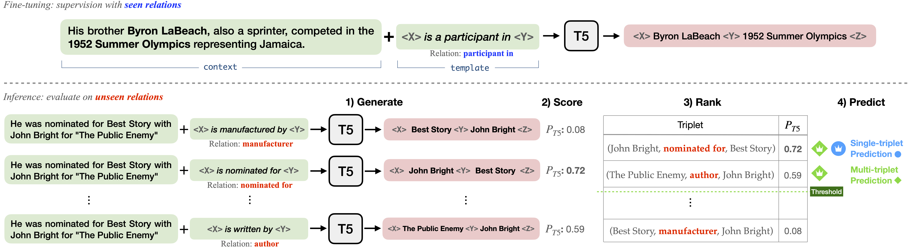

# Zero-shot Triplet Extraction by Template Infilling

[]()
[](https://arxiv.org/abs/2212.10708)
[](https://paperswithcode.com/sota/zero-shot-relation-triplet-extraction-on?p=zero-shot-triplet-extraction-by-template)

This repository contains the code and data for the paper [Zero-shot Triplet Extraction by Template Infilling](https://arxiv.org/abs/2212.10708), accepted in IJCNLP-AACL 2023.



## Citations

```bibtex
@inproceedings{kim23zett,
    title = {{Z}ero-shot {T}riplet {E}xtraction by {T}emplate {I}nfilling},
    author = {Bosung Kim and
              Hayate Iso and
              Nikita Bhutani and
              Estevam Hruschka and
              Ndapa Nakashole and
              Tom Mitchell},
    booktitle = "IJCNLP-AACL",
    month = {November},
    year = {2023}
}
```

## Setup
To install requirements
```
pip install -r requirements.txt
```

## Data
Download: https://drive.google.com/drive/folders/1heVF8flYGfrxEnBqNvjYcgTzpSBke6IV?usp=share_link

Put data folder under the *outputs* directory. e.g., ZETT/outputs/data/fewrel/unseen_10_seed_0/train.jsonl


## Train
For each dataset, we have 30 different setups for 5/10/15 unseen relations and 5 different data folds. To train with a specific setting:

e.g. on FewRel dataset with the setting of 10 unseen relations and data fold #0:
```
python run_zett.py train --data_name ['fewrel'] --n_unseen_rel [10] --rd_fold [0] --model_name {model_name}
```

e.g. on wiki-ZSL dataset with the setting of 15 unseen relations and data fold #1, 2, 3:
```
python run_zett.py train --data_name ['wiki'] --n_unseen_rel [15] --rd_fold [1, 2, 3] --model_name {model_name}
```

To train for all settings at once:  
```
python run_zett.py train --model_name {model_name}
```


## Evaluate triplet extraction

### Test on the single-triplet test set

To test with a specific setting:

e.g. on FewRel dataset with the setting of 10 unseen relations and data fold #0:
```
python run_zett.py test --data_name ['fewrel'] --n_unseen_rel [10] --rd_fold [0] --model_name {model_name}
```

Test all setting: 
```
python run_zett.py test --model_name {model_name}
```

### Test on the multi-triplet test set
Set **eval_mode** option to *multi*
```
python run_zett.py test --model_name {model_name} --eval_mode 'multi'
```

### Inference *without* relation constraint
Set **use_label_constraint** option to *False*
```
python run_zett.py test --model_name {model_name} --use_label_constraint False
```


### Evaluate relation extraction (or relation classification)

Use **task_type** option to set the target task.

```
python run_zett.py test --model_name {model_name} --task_type RC
```

### Choice of templates

Train/test with the paraphrased templates from the back-translation (English-German) machine translation model.
```
python run_zett.py train --model_name {model_name} --templ_file templates/templates_paraphrased_top1.tsv

python run_zett.py test --model_name {model_name} --templ_file templates/templates_paraphrased_top1.tsv
```

---

### Disclosure 
Embedded in, or bundled with, this product are open source software (OSS) components, datasets and other third party components identified below. The license terms respectively governing the datasets and third-party components continue to govern those portions, and you agree to those license terms, which, when applicable, specifically limit any distribution. You may receive a copy of, distribute and/or modify any open source code for the OSS component under the terms of their respective licenses, which may be BSD 3 clause license and Apache 2.0 license. In the event of conflicts between Megagon Labs, Inc., license conditions and the Open Source Software license conditions, the Open Source Software conditions shall prevail with respect to the Open Source Software portions of the software. 

You agree not to, and are not permitted to, distribute actual datasets used with the OSS components listed below. You agree and are limited to distribute only links to datasets from known sources by listing them in the datasets overview table below. You are permitted to distribute derived datasets of data sets from known sources by including links to original dataset source in the datasets overview table below. You agree that any right to modify datasets originating from parties other than Megagon Labs, Inc. are governed by the respective third party’s license conditions. 

All OSS components and datasets are distributed WITHOUT ANY WARRANTY, without even implied warranty such as for MERCHANTABILITY or FITNESS FOR A PARTICULAR PURPOSE, and without any liability to or claim against any Megagon Labs, Inc. entity other than as explicitly documented in this README document. You agree to cease using any part of the provided materials if you do not agree with the terms or the lack of any warranty herein.

While Megagon Labs, Inc., makes commercially reasonable efforts to ensure that citations in this document are complete and accurate, errors may occur. If you see any error or omission, please help us improve this document by sending information to contact_oss@megagon.ai.


#### Datasets
All datasets used within the product are listed below (including their copyright holders and the license conditions).

For Datasets having different portions released under different licenses, please refer to the included source link specified for each of the respective datasets for identifications of dataset files released under the identified licenses.


| ID  | Dataset | Modified | Copyright Holder       | Source Link                                                       | License            | 
|-----|---------|----------|------------------------|-------------------------------------------------------------------|--------------------|
| 1   | WikiZSL | Yes      | University of Virginia | [source](https://github.com/UKPLab/emnlp2017-relation-extraction) | Apache-2.0 license |

#### Open Source Software (OSS) Components 
All open source software components used within the product are listed below (including their copyright holders and the license conditions).
For OSS components having different portions released under different licenses, please refer to the included Upstream link(s) specified for each of the respective OSS components for identifications of code files released under the identified licenses.

| ID  | OSS Component Name   | Modified | Copyright Holder | Upstream Link                                                                                                       | License            | 
|-----|----------------------|----------|------------------|---------------------------------------------------------------------------------------------------------------------|--------------------|
| 1   | run_summarization.py | Yes      | Hugging Face     | [link](https://github.com/huggingface/transformers/blob/v4.7.0/examples/pytorch/summarization/run_summarization.py) | Apache License 2.0 |
